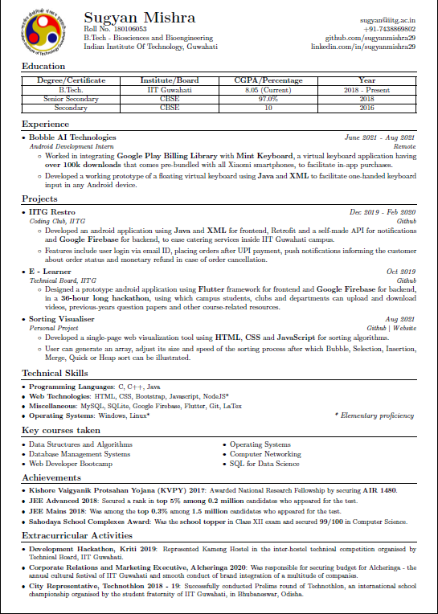

# LaTeX CV
I made my resume in IIT Guwahati template using LaTeX, a markup language for preparing a document. It is mainly used to create technical or scientific articles, papers, reports, books or Ph.D. thesis.

My resume looks something like this


## How to view the above PDF?
There are a number of LaTeX distributions you can install on Ubuntu. One such distribution is TeX Live.
1. To install Tex Live LaTeX distribution on ubuntu use the following command.
```shell
$ sudo apt-get install texlive-full  
```
2. To edit LaTeX documents we need an editor. There are a number of LaTeX editors you can find. I recommend Texmaker, a cross-platform LaTeX editor. To install Texmaker on Ubuntu use following command.
```shell
$ sudo apt-get install texmaker  
```
3. To open Texmaker on Ubuntu use following command
```shell
$ texmaker
```
4. Download index.tex file and open this file in Texmaker.
5. Compile the document clicking the arrow Quick Build.
